# Architecture

## One Mission, One Owner

The harness keeps the parent mission authoritative. A worker may change an
observation about one predicate; it cannot replace the mission, reorder its
predicates, or declare the parent complete.

```mermaid
flowchart LR
    O[Operator or host] --> M[Mission and ordered predicates]
    M --> F[First false predicate]
    F --> R[Shortest valid route]
    R --> P[Bounded TaskPacket]
    P --> L[Lease and CAS claim]
    L --> W[External worker adapter]
    W --> E[ExecutionResult]
    E --> T[TerminalReceipt]
    T --> C[Destination-bound continuation]
    C --> G[ConvergenceProof]
    G --> A[Callback, receipt, and continuation ACK identities]
    A --> B[Parent-owned MissionReadback]
    B --> V[MissionVerification]
    V -->|all predicates true| D[Mission complete]
    V -->|predicate still false| F
    V -->|route abandoned| R

    X[External persistence and effects] -. integration boundary .-> L
    X -. integration boundary .-> W
    X -. integration boundary .-> C
```

Dashed edges are deliberately outside this package. The reference store and
worker are in-process test doubles for their contracts.

## Decision Record

Every delegated packet preserves five fields:

| Field | Meaning |
|---|---|
| `mission` | The parent objective and ordered exit predicates |
| `first_false_predicate` | The only predicate eligible for the current action |
| `shortest_valid_route` | The selected bounded way to change that predicate |
| `expected_predicate_delta` | The measurable state change expected from success |
| `abandon_if` | The condition that ends this route instead of creating a recursive mission |

The exact Python field names are defined by the public dataclasses. The
five-part decision record is a control contract, not a prompt-writing style.

## Lifecycle

1. **Select.** Read the mission in declared order and select its first false
   predicate. A mission with no false predicate is already complete and cannot
   dispatch more work.
2. **Route.** Choose one bounded route. The reference accepts an explicit route;
   it does not rank arbitrary real-world tools or grant their authority.
3. **Packetize.** Create a task packet bound to the mission revision, predicate,
   route, expected delta, abandon condition, and declared scope.
4. **Claim.** Acquire the scope in the reference store and record the CAS
   version. A stale version or overlapping live claim fails closed.
5. **Execute.** Pass the packet to an adapter. The adapter returns a typed
   result; it never edits the mission directly.
6. **Terminalize.** Reconcile result and ownership into one terminal receipt,
   then release the exact task lease. An unsettled effect retains its recorded
   attempt and lease until `EffectReconciliation` settles that same effect;
   reconciliation must not call the executor a second time.
7. **Continue.** Prepare one destination-bound continuation from the terminal
   receipt. A failed delivery remains `PREPARED`; retry uses the same
   continuation identity. Human-readable prose is not a routing identity.
8. **Prove convergence.** Confirm that the destination observed the exact
   terminal result. Without this proof, acknowledgement is forbidden.
9. **Acknowledge.** Atomically bind callback, receipt, and continuation ACK
   identities. The task lease was already released at terminalization. A replay
   cannot generate a new acknowledgement or effect.
10. **Verify mission.** Obtain an exact parent-owned `MissionReadback` for the
    current mission revision and predicate, then re-read the ordered predicates.
    Complete only when all are true; otherwise select the current first false
    predicate or another valid route. A worker result is advisory here.

## Data Ownership

| Object | Owner | What it may establish |
|---|---|---|
| `Mission` and `ExitPredicate` | Parent host | Objective, order, current truth, revision |
| `Route` | Parent decision layer | Selected bounded path and declared scope |
| `TaskPacket` | Parent dispatch layer | Immutable child contract |
| `Lease` | Store adapter | Temporary ownership and CAS precondition |
| `ExecutionResult` | Worker adapter | Claimed outcome of one attempt |
| `EffectReconciliation` | Effect/recovery adapter | Settlement of the already-recorded attempt without re-execution |
| `TerminalReceipt` | Harness/store boundary | Accepted terminal state and release of the exact task lease |
| `Destination` | Parent continuation layer | Exact callback target |
| `Continuation` | Harness/store boundary | Stable callback/outbox identity independent of the task lease |
| `ResumeProof` and `ConvergenceProof` | Destination adapter | Evidence that the exact destination resumed and observed the result |
| `Acknowledgement` | Harness/store boundary | Callback, receipt, and continuation ACK identities after convergence |
| `MissionReadback` | Parent host | Authoritative truth for the exact current mission revision and predicate |
| `MissionVerification` | Parent host | Next predicate or actual mission completion |

No child-owned object grants permission to mutate external systems.

## Success Definition

Task success and mission success are different predicates:

- **task terminal:** one packet has an accepted terminal receipt and its task
  lease is released;
- **continuation converged:** the exact destination has the exact terminal
  result and can be acknowledged;
- **mission complete:** after convergence, all ordered exit predicates read
  true in parent-owned state.

The harness closes the graph only when these distinctions remain observable.
